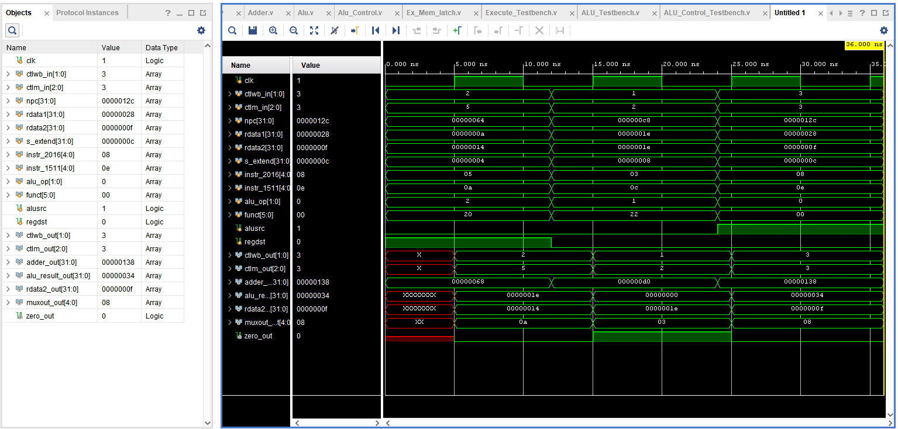

# A3_Execute_ECE4300

Adder.v       : 32 bit adder  
Alu.v         : performs arithmetic operations based on alu control  
Alu_Control.v : tells the ALU what operation to perform  
Ex_Mem_latch.v: passes the output onto the next stage  
Execute.v     : top module wiring everything together  
 
ALU_Control_Testbench.v: tests alu control  
ALU_Testbench.v        : tests alu  
Execute_Testbench.v    : tests entire module  
   

